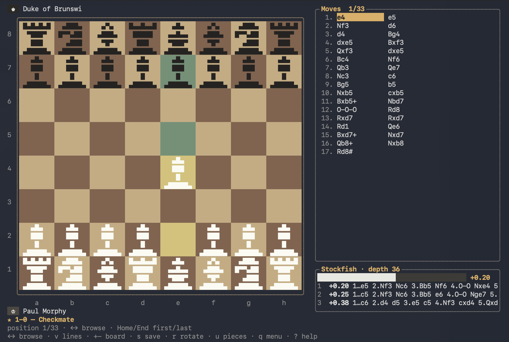

# ♞ ChessTTY



Chess in your terminal, written in C, with **Stockfish built in**: the engine is
downloaded and compiled automatically by the build.

- **Online play on Lichess** with browser login, matchmaking and live server clocks
- **Local two-player games** on the same keyboard, with minutes and increment
- Play against Stockfish, picking a **difficulty from 1 to 100** with a slider
- **Load PGN** and analyze the game move by move
- **Load FEN** to set up any position
- **Analysis board**: play both sides freely with the engine's lines beside you
- **Annotations**: a text comment on any position plus `!` `!!` `!?` `?!` `?` `??`
  move marks, saved and reloaded as standard PGN
- **Games database**: a folder of PGN files with an instant binary index —
  browse, search and store your games and the famous ones
- **Opening explorer**: browse Lichess opening lines offline, without an engine
- Automatic **opening name and ECO code** during games and PGN playback,
  including transpositions; no opening suggestions during play
- **Live analysis**: the 3 best moves computed by a dedicated, full-strength
  Stockfish instance
- Board drawn with UTF-8 characters, truecolor palette (256-color fallback).
  Four board sizes with auto-fit, on large boards the pieces become
  **multi-cell block-art sprites** that fill the squares

## Download

Ready-to-run archives are on the
[Releases](https://github.com/gslf/ChessTTY/releases) page — Linux (x86_64,
arm64), macOS (universal) and Windows (x86_64). The engine travels with the
binary. Linux also needs the system libcurl and OpenSSL 3 runtime libraries:

```bash
tar xzf chesstty-1.0.0-linux-x86_64.tar.gz
cd chesstty-1.0.0-linux-x86_64
./chesstty
```

`SHA256SUMS.txt` in the release checks the archives. On macOS the binaries are
built for macOS 11 or newer and include native Intel and Apple Silicon slices.
They use ad-hoc signatures, without Developer ID notarization, so Gatekeeper
may quarantine them: run
`xattr -dr com.apple.quarantine chesstty engine/stockfish` once in the
extracted folder.

## Release verification

Tag pushes build Linux x86_64/arm64, macOS universal and Windows x86_64 archives.
Manual runs and pull requests affecting the build also run the release pipeline
without publishing. x86_64 release engines use the baseline architecture rather
than the build runner's native CPU instructions.

Publication waits for tests of the extracted archives: Linux in Ubuntu 22.04
containers with runtime packages only (also Ubuntu 24.04 on x86_64), macOS on
both Intel and Apple Silicon runners, and Windows with MSYS2 removed from the
application's PATH. The checks run from an unrelated directory, verify the
required package files and application startup/version. macOS also checks
binary metadata. They never launch Stockfish or contact Lichess. macOS dependencies must be system libraries.

Linux needs glibc 2.35 or newer, libcurl 4, OpenSSL 3, libstdc++6 and a system CA
store (Ubuntu 22.04 or newer). Windows builds use UCRT and Schannel on Windows
10/11; static dependencies and their license notices travel in the archive.
macOS uses system libcurl and CommonCrypto. macOS binaries receive ad-hoc signatures after universal linking, verified on
both architectures. The build does not provide Developer ID notarization or
Windows Authenticode signatures.

For a local archive check:

```bash
python3 tools/check_release.py dist/chesstty-VERSION-linux-x86_64.tar.gz --version VERSION
```

## Building

Requirements: `make`, a C compiler (for the TUI) and a C++17 one (for
Stockfish), plus `git` and `curl` (to fetch the sources and the neural
network the first time). HTTPS uses libcurl; OAuth PKCE uses OpenSSL on Linux,
CommonCrypto on macOS and BCrypt on Windows.

On Debian/Ubuntu install `libcurl4-openssl-dev libssl-dev`. On Arch install
`curl openssl`. macOS uses the system SDK libraries. On Windows, build in
MSYS2 UCRT64 with `make` and `pacboy -S gcc:p curl-winssl:p pkgconf:p`; the build links
libcurl and its dependencies statically and uses the Windows certificate store.

```bash
make
```

The first run downloads the Stockfish 17.1 sources, builds them and puts the
binary in `engine/stockfish`. Subsequent builds are instant.

`sudo make install` puts it in `PATH` (`/usr/local/bin/chesstty` plus
`/usr/local/lib/chesstty/stockfish`; set `PREFIX=` for somewhere else,
`make uninstall` to remove it). `make dist` builds the release archive.

Already have your own Stockfish? `./chesstty --engine /path/to/stockfish`
or set the `CHESSTTY_ENGINE` environment variable.

`make test` is offline and needs no Stockfish installation. It checks chess
logic, openings, PGN, database indexing, clocks and the UCI protocol using a
small deterministic engine fixture. Lichess responses come from JSON fixtures;
OAuth transport is mocked in memory, including fragmented reads and EAGAIN.
Unexpected real HTTP dispatch fails the unit test. No TCP sockets or browser
are opened by the OAuth tests, on any platform.

`make test-keybindings` builds a test TUI with the online boundary mocked,
uses the same fake UCI engine and a POSIX pseudo-terminal
at 78×22. It smoke-tests prefix commands, cancellation and context changes.
Clock accuracy, PGN and database logic belong to the C tests.
Stockfish is built for release packaging only; the automatic test suites never
execute it. Neither CI nor release validation sends requests to Lichess.


## Using

```bash
./chesstty                    # main menu
./chesstty game.pgn           # jump straight into PGN analysis
./chesstty --fen "8/8/8/8/8/5k2/6q1/7K w - - 0 1"
./chesstty --db               # open the games collection
```

Press **Ctrl+x** (`C-x`), release it, then press a listed key. A centered panel
shows the commands for the current screen. The small `C-x commands` label in
the top border is the only persistent shortcut hint; there are no footer help
lists. `C-g`, Esc or another `C-x` closes the panel without changing your input.
Unknown command keys keep the panel open and never reach the move/search field.

| Context | Sequence | Action |
|---|---|---|
| Database | `C-x s` | Search all metadata fields |
| Database | `C-x d` | Sort by date / toggle direction |
| Database | `C-x o` / `C-x r` / `C-x i` | Cycle sort / reverse / rebuild index |
| Board | `C-x w` / `C-x b` | Write PGN / save to database |
| Play / analysis | `C-x a` / `C-x m` | Edit annotation / cycle move glyph |
| Play / analysis | `C-x v` / `C-x u` | Toggle engine lines / undo |
| Board | `C-x r` / `C-x p` | Rotate / cycle piece style |
| Board | `C-x +` / `C-x -` | Larger / smaller board |
| Play | `C-x n` | New game (confirmation required) |
| Main menu | `C-x h` / `C-x l` | Local two-player / Lichess lobby |
| Lichess lobby | `C-x l` / `C-x s` / `C-x r` | Log in / find opponent / resume |
| Lichess lobby | `C-x c` / `C-x o` | Cancel matchmaking / log out |
| Online board | `C-x z` / `C-x d` / `C-x x` | Resign (confirm) / offer or accept draw / abort |
| Main menu | `C-x p` / `C-x a` / `C-x o` | Play / analysis / opening explorer |
| Main menu | `C-x f` / `C-x e` / `C-x b` | Open PGN / FEN / database |
| All screens | `C-x q` | Back; quit from the main menu |
| Text editor | `C-x c` / `C-x g` | Confirm / cancel input |

Navigation and text entry remain direct: arrows, Home/End, Page Up/Down,
Backspace and Enter; type SAN or UCI moves normally. Esc goes back or cancels
input; `C-g` only cancels input, never leaves the current screen. During a
confirmation or promotion, `C-x` shows the relevant choices. The old bare-letter
action shortcuts are removed.

- Piece letters use English SAN (K, Q, R, B, N), the PGN standard
- PGN files with several games show a picker
- Automatic draws: stalemate, insufficient material, fifty-move rule and
  threefold repetition.

## Timed games and Lichess

Choose **Minutes per player** and **Increment (seconds)** with the arrow keys
before starting a local game or a game against Stockfish. Each player gets the
selected time; a legal move adds the increment and starts the other clock.
Local games start White's clock immediately. Opening a command panel, entering
a move, or browsing history keeps the live clock running. Leaving a local game
ends that session; takebacks against Stockfish restore the recorded clocks.

Select **Play online on Lichess** (`C-x l` from the menu), then **Log in with
Lichess** (`C-x l`). Authorize ChessTTY in your browser and return to the terminal.
Login uses OAuth with PKCE and the `board:play` permission. The session token
stays in memory and is removed on logout or exit; log in again after restarting.
Browser authorization returns through a temporary loopback listener on the same
computer, so login requires a local desktop browser. Logout does not revoke the
application grant in your Lichess account settings.

Set the time and colour in the lobby, then choose **Find an opponent** (`C-x s`).
Public matchmaking creates casual standard games with Rapid or Classical time
controls, as required by the [Lichess Board API](https://lichess.org/api#tag/Board).
The default is 10+0. **Resume / reconnect game** (`C-x r`) attaches to an existing
compatible game; other variants are not supported. Cancel matchmaking with
`C-x c`. No engine is started or offered in online or local two-player games.

Type SAN or UCI moves and press Enter. Online moves appear after confirmation
from the game stream. Clocks are synchronized from Lichess and projected using
monotonic elapsed time between updates. Network disconnections trigger a retry;
`~` marks estimated clocks until synchronization returns. Lichess decides timeout
results, including lag compensation. Returning to the lobby keeps the online
game running; use the resignation command to resign.

Saved PGNs include `TimeControl` and `[%clk ...]` records. Online saves retain
clock snapshots received during this session; a resumed game's earlier clocks
are unavailable when the stream does not supply them.

## Analysis board

**Analysis board**, **Load PGN** and **Load FEN** all land on the same board:
you move for both colours, Stockfish comments from the side, and the opening
name follows along. Playing a move that is already in the line just steps
forward; playing a different one starts a new line from there and says how many
moves it replaced. `C-x u` takes the last move back.

The player clocks show the recorded time at the selected move and stay fixed
while you study it. A missing clock record appears as `--:--`. The Stockfish panel
also shows elapsed thinking time for the current search, resetting when the
position changes. It measures elapsed monotonic time, independently of redraws.

`Load FEN` refuses positions that cannot occur — a missing king, or the side
that just moved still in check — rather than handing the engine something it
would disagree with.

## Annotations

`C-x a` opens an editor for the position currently on screen; `C-x m` cycles the mark on
the move that led to it. Annotated moves turn gold in the move list and carry a
`•`, and the note itself appears in its own panel under the moves.

Annotations are plain **PGN comments** and **numeric annotation glyphs**, so they
survive a round trip through any other chess program, and comments already
present in a PGN you open show up as annotations. They work in a live game and
on the analysis board alike, however the position got there. Each game holds
16 KB of annotation text, sparse: a game without notes costs nothing.

## Games database

A collection is an ordinary **folder of PGN files** plus one binary sidecar,
`index.ctdb`. Nothing is imported into a private format — the games stay in the
files you (or any other program) put there, and deleting the sidecar loses
nothing.

The index holds one fixed **496-byte record per game**: the listing columns plus
the byte range the game occupies in its file. That single decision is what makes
the feature fast:

| | |
|---|---|
| Opening a collection | one sequential read of the index — no PGN is parsed |
| Scrolling, sorting, searching | touches only the flat record array; sorting permutes 4-byte indices, never records |
| Opening one game | seeks to its byte range and reads *only that game* |
| Saving a game | appends to a PGN file and appends one record — no rewrite |

Search works directly on the metadata index and narrows the existing matches
when you extend the query. The index uses 496 bytes per game to preserve full
player/event names plus site, round and starting FEN; sorting still moves only
4-byte row indices.

The index is a cache, never the source of truth. Each file's size and
modification time are stored with it, so only files that actually changed are
re-read. Paths are stored relative to the folder, so moving or renaming the
collection — or just opening it by a different spelling of the same path — still
hits the cache. A corrupt, truncated or foreign index is silently rebuilt.

Indexing streams the file in windows rather than loading it, so a collection far
larger than RAM still indexes in a few megabytes.

Open it from the main menu, or with `--db [FOLDER]`. The default lives in
`$XDG_DATA_HOME/chesstty/games` (or `~/.chesstty/games`) and is seeded with the
bundled famous games the first time. A single `.pgn` file works as a collection
too. In the listing, `C-x s` searches every available metadata field as you type:
White, Black, Event, Site, Round, date, result, both Elo ratings, ECO, move/ply
count, source filename and starting FEN (`setup` / `standard`). Every word must
match, in any order, without case sensitivity for ASCII letters. For example,
`Fischer 1972 1-0` combines a player, year and result. Dates accept `YYYY.MM.DD`,
`YYYY-MM-DD` or `YYYY/MM/DD`; a year alone also works. This searches metadata,
not move text or annotations. Enter keeps the filter; Esc clears it.

Press `C-x d` to sort by date, newest first; press it again for oldest first.
Unknown dates stay at the bottom. `C-x o` cycles the sort key, `C-x r` reverses it,
`C-x i` forces a full re-index, Enter opens the game on the analysis board and Esc
comes back to the list. A detail row shows the selected game's Elo, ECO, site,
round and filename. Older indexes are rebuilt automatically for the new fields.


`C-x b` during any game or analysis appends it, annotations included, to the
collection.

Select **Opening explorer** in the main menu. Use `↑↓` to choose a continuation,
`Enter` / `→` to follow it, `←` / Backspace to go back, `Home` to return to the
root and `End` to return to the last explored position. `C-x w` saves the explored
line as PGN. Board size, rotation and piece controls work as usual.

The explorer contains 3,810 opening lines from
[Lichess chess-openings](https://github.com/lichess-org/chess-openings), with the
original English names. It shows named lines, not statistics or evaluations.
During a game only the name of the most recent recognized opening is displayed;
it follows history navigation and takebacks. The explorer is separate from play.
Stockfish's existing optional analysis panel is still controlled with `C-x v`.

Opening data is compiled into the executable as a compact move tree and a sorted
position index. No runtime downloads, parsing, extra files or dependencies are
needed. Each move updates a cached name; redraw and history navigation use that
cache directly. Run `./chesstty --openings-test` for validation and a lookup
benchmark. Dataset provenance and regeneration instructions are in
[data/openings/README.md](data/openings/README.md).

Level 1–100 drives the engine's Elo (`UCI_LimitStrength`), thinking time and
search depth: from ~1300 Elo with near-instant replies up to full-strength
Stockfish (level 95+). The menu label shows the bracket (Beginner…
Grandmaster) and the approximate Elo.

The analysis panel uses a **separate** Stockfish instance always running at
full strength (MultiPV 3), so the suggestions stay reliable even when your
opponent is dialed down.


## License and attribution

ChessTTY is free software, released under the **GNU General Public License,
version 3 or later**, see [LICENSE](LICENSE).

Opening data is provided by [Lichess](https://github.com/lichess-org/chess-openings)
under the [CC0 Public Domain Dedication](data/openings/COPYING.txt).

This TUI is based on **[Stockfish](https://stockfishchess.org)** chess engine,
(see their [AUTHORS](https://github.com/official-stockfish/Stockfish/blob/master/AUTHORS)
file), licensed under the
[GPLv3](https://github.com/official-stockfish/Stockfish/blob/master/Copying.txt).
